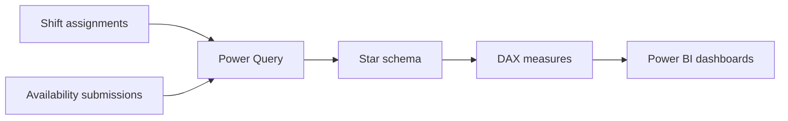

# Workforce Scheduling & Availability Analytics


An end-to-end Power BI solution that combines employee shift assignments with submitted availability to analyze staffing coverage, workload distribution, and scheduling alignment.

> **Privacy:** Every employee, email, date, and record included in this repository is synthetic. No operational or personally identifiable data is published.

## Dashboard Preview

### Management Overview

Executive-level view of scheduled hours, shift volume, workforce participation, monthly trends, shift-type distribution, and workload by employee.


### Scheduling & Availability

Operational view of daily staffing, assignments within and outside submitted availability, weekday coverage, and employee-level scheduling exceptions.


### Employee Analytics

Interactive employee-level analysis with a member slicer, monthly working hours, shift distribution, monthly KPI table, and workload by weekday.


## Portfolio Dataset Results

| KPI | Synthetic result |
|---|---:|
| Employees | 22 |
| Total shifts | 590 |
| Total hours | 2,688 |
| Working days | 63 |
| Average shift length | 4.56 hours |
| Assignments within availability | 433 |
| Assignments outside availability | 147 |
| Availability match rate | 74.66% |

## Business Questions Answered

- How many shifts and working hours were scheduled?
- How evenly was work distributed across employees and shift types?
- How often did assignments match employee availability?
- Which employees had the highest number of scheduling exceptions?
- How did staffing and workload change by month, weekday, and shift type?
- What does an individual employee's work pattern look like?

## Solution Architecture



## Data Model

| Table | Role |
|---|---|
| `FactShifts` | One row per assigned employee shift |
| `FactAvailability` | One row per available employee/date/shift option |
| `DimEmployee` | Standardized employee lookup |
| `DimDate` | Calendar, month, and weekday attributes |
| `DimShiftType` | Normalized shift categories |

Dimensions filter the fact tables through one-to-many, single-direction relationships.

## Data Preparation

Power Query was used to:

- Combine monthly availability extracts.
- Standardize employee names, dates, times, and shift labels.
- Unpivot availability selections into an analysis-ready fact table.
- Remove blank and duplicate submissions.
- Resolve inconsistent employee-name variants through a mapping layer.
- Build a composite employee-date-shift key.
- Classify each comparable assignment as within or outside availability.
- Exclude `Manager's Shift` from availability matching because no equivalent availability option exists.

## Selected DAX Measures

```DAX
Total Hours =
SUM(FactShifts[HoursWorked])

Assignments Outside Availability =
CALCULATE(
    [Total Shifts],
    FactShifts[AvailabilityStatus] = "Outside Availability"
)

Availability Match % =
DIVIDE(
    [Assignments Within Availability],
    [Comparable Assignments]
)
```

The complete measure definitions are available in [`documentation/DAX_Measures.md`](documentation/DAX_Measures.md).

## Repository Structure

```text
Workforce_Analytics_Portfolio.pbix
README.md
CV_Bullet.txt
sample_data/
  Workforce_Analytics_Synthetic_Data.xlsx
documentation/
  DAX_Measures.md
  Power_Query_Transformations.md
screenshots/
  management-overview.png
  scheduling-availability.png
  employee-analytics.png
```

## Recreate the Dashboard

1. Download the synthetic workbook from `sample_data`.
2. Load `FactShifts`, `FactAvailability`, and `DimEmployee` into Power BI.
3. Create `DimDate` and `DimShiftType` using the documented examples.
4. Create the star-schema relationships.
5. Add the documented DAX measures.
6. Rebuild or customize the three report pages shown above.

## Skills Demonstrated

`Power BI` · `Power Query` · `DAX` · `Data Cleaning` · `Data Modeling` · `ETL` · `Dashboard Design` · `Workforce Analytics` · `Business Intelligence`

## Project Context

This project demonstrates how separate scheduling and availability sources can be transformed into a reusable analytical model. It highlights management-level workforce trends and actionable scheduling exceptions while protecting the underlying operational data.
